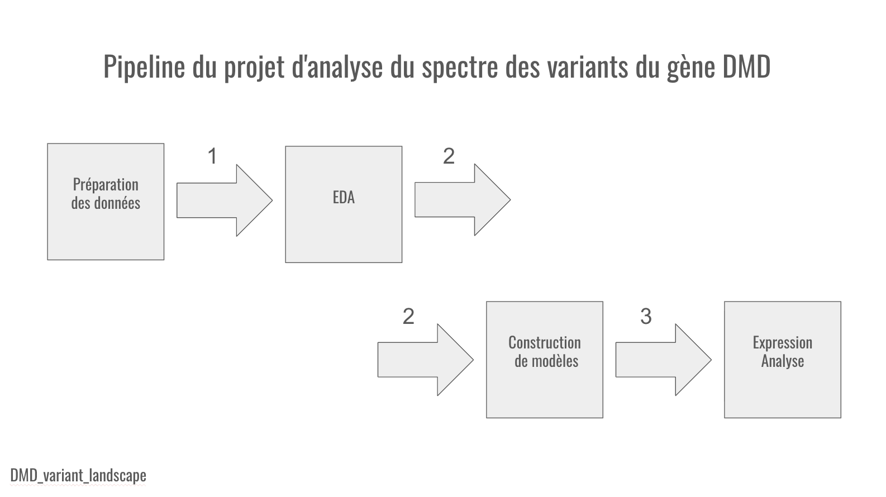

<p align="center">
  <a href="README_en.md">🇬🇧 English</a> |
  <a href="README_ja.md">🇯🇵 日本語</a> |
  <a href="README_fr.md">🇫🇷 Français</a> |
  <a href="README_ru.md">🇷🇺 Русский</a> 
</p>

# Analyse du spectre des variants du gène DMD : étude exploratoire basée sur des données fusionnées issues de ClinVar, Ensembl et gnomAD


---
### Résumé

Ce dépôt contient une analyse de recherche des variations pathogènes et non pathogènes du **gène DMD** humain en utilisant des données fusionnées provenant de sources bioinformatiques. L’objectif de l’étude est d’examiner les régularités structurelles et fonctionnelles de la pathogénicité au niveau des **exons**, des **domaines protéiques**, du **statut du cadre de lecture**, etc.

Un nettoyage et une fusion des jeux de données initiaux ont été effectués ; sur la base du dataset obtenu, une **analyse exploratoire** des variants a été réalisée ; deux **modèles de prédiction** de la pathogénicité d’un variant du gène DMD ont aussi été construits sur la base de la **régression logistique** (LogisticRegression) et de la **forêt aléatoire** (RandomForest). De plus, une **analyse d’expression génique** a également été réalisée chez des patients sains et chez des patients souffrant de **dystrophie musculaire de Duchenne ou de Becker**, afin d’identifier l’influence de la maladie sur l’expression du **gène DMD** et sur l’**expression génique globale** dans l’organisme.

---

### Sommaire

- [Objectif du projet](#objectif-du-projet)
- [Points principaux et pipeline du projet](#points-principaux-et-pipeline-du-projet)
- [Jeux de données](#jeux-de-données)
- [Méthodes](#méthodes)
- [Métriques de modèles obtenues](#métriques-de-modèles-obtenues)
- [EDA : cohérence avec la littérature](#eda--cohérence-avec-la-littérature)
- [Résultats research-gap (??)](#résultats-research-gap-)
- [Structure du projet](#structure-du-projet)
- [Reproductibilité](#reproductibilité)
- [Étapes suivantes](#étapes-suivantes)
- [Licence](#licence)
- [Statut du projet](#statut-du-projet----)

---

### Objectif du projet

Le **gène DMD** est le plus grand gène connu du génome humain, situé sur le chromosome X, codant la protéine **dystrophine**. Cette protéine relie la **charpente structurelle** des cellules musculaires à la **matrice environnante**. Les variations pathogènes du gène DMD conduisent à une **altération de la synthèse de la dystrophine**, ce qui entraîne un groupe de **maladies héréditaires graves**, dont la **dystrophie musculaire de Duchenne** (DMD), forme sévère menant à une progression rapide de la faiblesse musculaire, à la perte de la marche et à la cardiomyopathie, et la **dystrophie musculaire de Becker** (BMD), forme plus légère caractérisée par une faiblesse musculaire lentement progressive.

L’objectif du projet est d’**étudier différents marqueurs** et patterns de variations dans le gène, qui déterminent leur **pathogénicité** et leur **non-pathogénicité**, y compris pour la possibilité ultérieure de **prédire**, sur cette base, la **pathogénicité des variations découvertes ensuite**.

---

### Points principaux et pipeline du projet

Image montrant le **pipeline** de ce projet :



À l’étape de **préparation des données**, **trois tables** de variants du gène DMD ont d’abord été collectées à partir des bases **ClinVar**, **Ensembl** et **gnomAD**. Ensuite, les clés ont été **uniformisées** (par exemple, ``var_id``, ``rsid``), les formats des coordonnées et des champs catégoriels ont été **ramenés** à un standard unique, les **doublons techniques** et les catégories vides ont été **supprimés**, et les variables numériques ont été **normalisées** avec un traitement explicite des valeurs manquantes. Après cela, une **"fusion" progressive** a été appliquée (left-join depuis la table principale des variants), en **contrôlant** à chaque étape les pertes de lignes, l’augmentation des manquants et la cohérence des champs. Le code de tout ce qui précède se trouve dans ``src/data_preparation.py``.

Ensuite, les variants sont **annotés** : dans ``src/annotate_variants.py``, le script charge la **table des variants** et deux **tables de référence** (limites des domaines de la protéine dystrophine et coordonnées des exons DMD), puis assigne pour chaque variant un domaine selon la **position d’acide aminé** et un exon selon les **coordonnées génomiques**. Après cela, des caractéristiques dérivées sont construites, telles que le **type de mutation** et le **statut du cadre de lecture** : le type de mutation est agrégé à partir des colonnes consequence/variant-type avec une règle séparée pour les grands événements, quand la variation se produit au niveau de **plusieurs nucléotides** et que sa longueur est supérieure à 50, et le statut du cadre de lecture est inféré de la **classe de mutation**. En sortie, on obtient ``DMD_variants_annotated.csv``, le dataset avec lequel le **travail ultérieur** est réalisé.

L’analyse exploratoire commence avec ``notebooks/00_data_preview.ipynb`` et ``notebooks/01_annotation_check.ipynb``, puis les blocs de ``notebooks/02_EDA`` sont parcourus de manière **systématique**. Aux étapes initiales ont été vérifiés : l’**unicité** de ``var_id`` et ``rsid``, les doublons, la part de manquants, la cohérence de ``chr`` et ``pos``, la couverture par domaines, exons et statut de cadre de lecture. En conséquence, il est apparu que les données sont globalement adaptées aux analyses statistiques, cependant les manquants sont distribués de manière non uniforme, car ils sont plus souvent concentrés dans des variants plus **complexes** et des classes de mutation spécifiques ; il était donc impossible d’interpréter un manquant comme un bruit aléatoire.

Ensuite, les tests ont donné une **image principale du spectre** par phénotype, type de mutation, statut du cadre de lecture, domaine, ``consequence``, longueur d’intervalle, métriques ``REVEL/meta_lr``, fréquence allélique, ainsi que par exons et positions d’acides aminés. Dans la majorité des comparaisons par tableaux croisés et par rangs, la structure s’est révélée **non aléatoire** : les groupes cliniques diffèrent effectivement par types de mutation et contexte moléculaire, les variants pathogènes sont plus souvent liés à des ``consequence`` plus « radicales », et les caractéristiques populationnelles se comportent comme attendu vers des fréquences plus faibles pour les variants cliniquement significatifs.

La vérification des hypothèses ``⭐`` (résultats de la littérature scientifique) a globalement **confirmé les appuis littéraires connus** : reading-frame rule (lien entre statut du cadre de lecture et phénotype DMD/BMD), architecture hotspot des exons (incluant la zone distale 45-55), **pertinence clinique** des régions isoformes et distales (dp140, dp71), ainsi que le **focus thérapeutique** des régions skip (dont skip51). Les observations domaine-structure et les métriques fonctionnelles ``score`` REVEL et MetaLR comme marqueurs de pathogénicité concordent également.

Les blocs ``📖`` ont montré des enrichissements rares de ``consequence``, des profils d’entropie, une **analyse des exceptions** à la règle du statut du cadre de lecture et des anomalies domaine-position. Le résultat principal est la **mise en évidence de zones concrètes** où l’annotation diverge ou reste **incomplète**. Ces « zones » exigent une **validation externe** sur un ensemble indépendant et une révision approfondie ; elles peuvent représenter soit un vrai nouveau signal, soit un artefact de cette source.

Dans la construction des modèles de prédiction, la tâche de **classification binaire** des variants DMD en ``pathogenic`` et ``benign`` a été résolue sur la base de caractéristiques annotées issues du pipeline commun (``exon/domain/mutation/frame`` et autres champs). La préparation des données a été réalisée avec un accent sur le filtrage des catégories bruitées, le contrôle des doublons, le feature engineering, ainsi que la vérification de robustesse par validation croisée. Deux modèles de base interprétables ont été entraînés — **LogisticRegression** et **RandomForest**, sauvegardés en ``.pkl``. L’évaluation a été construite sur un ensemble de métriques telles que ``accuracy``, ``AUROC``, ``confusion matrix``.

Le résultat de qualité est **fort** : un haut niveau de précision a été atteint (pour LogisticRegression : accuracy ``~0.982``, AUROC ``~0.995``). La AUROC élevée a été considérée avec les métriques dépendantes du seuil et les risques de fuite, ce qui rend les conclusions reproductibles. Néanmoins, une **validation externe est requise** sur un dataset indépendant.


Dans le **bloc d’expression**, nous avons utilisé le jeu **Gene Expression Omnibus** ``GSE38417``, où la **matrice d’expression** et les **phénotypes** ont été extraits, et des groupes **DMD** et **contrôle** ont été formés. Après cela, une **analyse différentielle** a été réalisée pour observer le comportement de ``DMD`` et des marqueurs associés chez les malades par rapport au contrôle.

Selon les résultats obtenus, les signaux différentiels mettent en évidence des **gènes de régénération musculaire** (dont ``MYH3/MYH8``), ce qui est cohérent avec les dommages chroniques et la **réponse régénérative** dans la dystrophie musculaire de Duchenne.


---

### Jeux de données

Le projet utilise un dataset intégré de variants du **gène DMD**, assemblé à partir des sources ouvertes **ClinVar** (interprétation clinique), **Ensembl** (annotation génomique-transcriptomique) et **gnomAD** (fréquences populationnelles). La table de travail finale est stockée dans :
```commandline
data/processed/DMD_variants_annotated.csv
```

La table contient les champs clés pour l’analyse **clinico-génétique** : coordonnées du variant, **type** d’événement, consequence, exon, domaine, **statut** du cadre de lecture, **scores** fonctionnels REVEL, MetaLR, et étiquettes cliniques de pathogénicité/phénotype.

Taille du jeu final : **11308 variants sur 29 caractéristiques**. Pour les classes cliniques de `clinvar_class_simple` sont présentes des variantes pathogènes (`pathogenic`, 2858), probablement pathogènes (`likely_pathogenic`, 560), saines (`benign`, 640), probablement saines (`likely_benign`, 3062), à conséquences inconnues (`vus`, 3251), et autres (`other`, 937) ; par phénotype dans `phenotype_group` : dystrophie musculaire de Duchenne (`DMD`, 7807), dystrophie musculaire de Becker (`BMD`, 1023), et autres (`other`, 2478). Pour l’expression, un jeu de données séparé de **Gene Expression Omnibus** est utilisé — **GSE38417**.

Les limites du jeu sont liées à la nature des bases sources : ce sont des observations agrégées avec une profondeur d’annotation clinique hétérogène ; une partie des champs peut être incomplète ou ambiguë (par exemple `vus`, formulations mixtes du phénotype et de l’état du patient).

Principales sources de biais : dans **ClinVar**, ce sont surtout des variants cliniquement intéressants qui sont publiés, **label-noise** dans les catégories likely/vus, hétérogénéité populationnelle des fréquences **gnomAD**, et dépendance d’un certain nombre de caractéristiques à la qualité de l’annotation primaire.

### Je remercie les administrateurs des bases mentionnées ci-dessus pour la mise à disposition en accès ouvert des données génomiques et cliniques.

**Veuillez noter** que ce dépôt contient uniquement des données traitées. Les données sources restent soumises aux licences des bases de données d’origine (voir `data/raw/raw_info.md`).

---
### Méthodes

Pour ``02_EDA``, nous utilisons un stack statistique unique et reproductible : normalisation et nettoyage préalables des champs catégoriels et numériques (y compris la suppression des catégories placeholder), puis combinaison d’analytique descriptive (fréquences, parts, tableaux croisés, CI, entropie) et de tests d’hypothèses adaptés au type de données — Fisher Exact pour 2x2 et événements rares, khi-deux pour associations catégorielles, tests de Mann-Whitney et Kruskal-Wallis pour comparaisons non paramétriques de distributions, Spearman pour relations monotones et KS pour comparaison des formes de distribution ; les résultats sont visualisés dans Plotly (bar, heatmap, box, scatter, density, lollipop).

Dans la partie ML du projet, une tâche de classification binaire des variants DMD est résolue : ``pathogenic`` contre ``benign``. L’étiquette cible est formée depuis ``clinvar_class_simple`` selon le schéma ``likely-inclusive`` : ``pathogenic + likely_pathogenic`` est ``1``, ``benign + likely_benign`` est ``0``, les variants des autres classes ne sont pas inclus dans l’entraînement. Cela permet d’utiliser davantage d’exemples annotés en conservant le sens clinique de la cible. Avant l’entraînement, déduplication et suppression des doublons conflictuels sont effectuées (quand le même variant apparaît avec des étiquettes différentes).

Comme caractéristiques, on utilise les propriétés structurelles et fonctionnelles du variant : numéro d’exon, domaine protéique, type de mutation agrégé, statut du cadre de lecture, consequence/variant-type, ainsi que des caractéristiques numériques (``interval_length``, ``aa_pos``, ``revel``, ``meta_lr``, ``allele_freq`` etc). Les caractéristiques catégorielles sont encodées via `OneHotEncoder`, les numériques sont mises à l’échelle et, si nécessaire, imputées dans le pipeline. Il est important de noter que les champs directement impliqués dans la construction de la cible ne sont pas utilisés comme variables d’entrée.

Deux modèles sont entraînés : ``LogisticRegression`` (comme base linéaire interprétable) et ``RandomForestClassifier`` (comme ensemble non linéaire). La régression logistique donne une interprétation stable de la contribution des caractéristiques via les coefficients, tandis que RandomForest capte mieux les interactions non linéaires entre caractéristiques moléculaires. Les deux modèles sont entraînés dans un pipeline de prétraitement unique, ce qui rend la comparaison correcte et reproductible.

Pour la validation, un schéma tenant compte des groupes est utilisé afin que des variants proches ne fuient pas entre train et test. À l’étape de validation croisée, ``StratifiedGroupKFold`` est appliqué, et dans l’évaluation finale, les métriques holdout sont en plus fixées. La qualité est évaluée par un ensemble d’indicateurs (``ROC-AUC``, ``accuracy``, ``balanced accuracy``, ``F1``, ``confusion matrix``), ainsi que via des sanity-checks (y compris des tests de permutation) sur les risques de fuite et de surapprentissage. Les deux modèles entraînés sont sauvegardés dans ``models/`` comme artefacts ``.pkl`` séparés.

---
### Métriques de modèles obtenues

Dans le projet, l’évaluation de la qualité est divisée en deux niveaux : **holdout** (échantillon de test séparé) et **validation croisée group-aware**. Pour le holdout, nous calculons quatre métriques clés : ``accuracy``, ``AUROC``, ``F1``, ``balanced accuracy``, afin de ne pas s’appuyer sur un seul chiffre. La meilleure a été la régression logistique.

Pour la **CV** (5-fold StratifiedGroupKFold), nous calculons les mêmes quatre métriques et examinons la moyenne et la dispersion par fold.

Conclusion clé de cette section : holdout et validation croisée donnent une image cohérente sans chute brutale hors entraînement, et la dispersion entre folds est faible, ce qui parle en faveur de la stabilité du pipeline. En même temps, la principale limite demeure : **absence de validation externe**.


| Model | Holdout Accuracy | Holdout ROC-AUC | Holdout F1 | Holdout Balanced Acc | CV Accuracy (mean ± std) | CV ROC-AUC (mean ± std) | CV F1 (mean ± std) | CV Balanced Acc (mean ± std) |
|---|---:|---:|---:|---:|---:|---:|---:|---:|
| LogReg_tuned | 0.9833 | 0.9950 | 0.9825 | 0.9829 | 0.9815 ± 0.0041 | 0.9965 ± 0.0009 | 0.9813 ± 0.0043 | 0.9815 ± 0.0041 |
| RandomForest_tuned | 0.9822 | 0.9936 | 0.9813 | 0.9817 | 0.9806 ± 0.0030 | 0.9948 ± 0.0008 | 0.9804 ± 0.0031 | 0.9806 ± 0.0029 |

---
### EDA : cohérence avec la littérature

#### 1. Reading-frame rule : confirmé au niveau cohorte

Dans l’analyse, le lien entre `frame_status` et le phénotype (`DMD/BMD`) reproduit l’observation classique : les variants `out-of-frame` sont significativement plus souvent associés à un profil clinique plus sévère, tandis que les `in-frame` à un profil plus léger. Cela est cohérent avec le modèle de base des dystrophinopathies, mais nous ne faisons pas d’overclaim au niveau du pronostic individuel de chaque variant.

**Article :**  
Koenig et al., 1989 — [PubMed](https://pubmed.ncbi.nlm.nih.gov/2491009/)  
Aartsma-Rus et al., 2006 — [PubMed](https://pubmed.ncbi.nlm.nih.gov/16770791/)


#### 2. L’architecture hotspot des exons est globalement cohérente avec les registres

La distribution des événements par exons dans notre jeu montre une clusterisation dans les zones chaudes, ce qui est cohérent avec les grandes bases DMD. Cela confirme que la structure des variants dans le projet est biologiquement plausible et ne ressemble pas à un artefact d’échantillonnage aléatoire.

**Article :**  
Bladen et al., 2015 (TREAT-NMD, >7000 mutations) — [PubMed](https://pubmed.ncbi.nlm.nih.gov/25604253/)  
Tuffery-Giraud et al., 2009 — [PubMed](https://pubmed.ncbi.nlm.nih.gov/19367636/)


#### 3. Régions skip thérapeutiques : la direction de l’effet coïncide avec la littérature
Dans le bloc `02N` (skip45/51/53), nous observons l’hétérogénéité clinique attendue selon les régions thérapeutiquement pertinentes, ce qui correspond à la logique de la littérature sur l’applicabilité de l’exon-skipping (y compris la priorité de l’exon 51 pour une part significative des patients). L’interprétation reste prudente : il s’agit d’un signal populationnel, et non d’une évaluation d’efficacité d’une thérapie spécifique.

**Article :**  
Aartsma-Rus et al., 2009 — [PubMed](https://pubmed.ncbi.nlm.nih.gov/19156838/)

#### 4. Isoformes distales (Dp140/Dp71) : la tendance est cohérente avec les travaux cliniques
Dans `02M`, les observations sur `dp140/dp71` et le phénotype concordent en direction avec les études où les segments distaux et les isoformes cérébrales sont associés à un profil clinique plus sévère/complexe. En même temps, nous ne transférons pas ces conclusions directement aux issues neurocognitives, car notre dataset n’est pas spécialisé pour une phénotypisation cognitive approfondie.

**Article :**  
Moizard et al., 1998 — [PubMed](https://pubmed.ncbi.nlm.nih.gov/9800909/)  
Bardoni et al., 2000 — [PubMed](https://pubmed.ncbi.nlm.nih.gov/10734267/)  
Milic Rasic et al., 2015 — [PubMed](https://pubmed.ncbi.nlm.nih.gov/25937795/)

#### 5. Signaux fonctionnels/populationnels : cohérents comme supporting evidence, mais pas comme standalone
Dans `02J/02K`, les signaux `REVEL/meta_lr` et les fréquences populationnelles (`in_gnomad`, `allele_freq`) se comportent dans la direction attendue pour la séparation benign vs pathogenic. Cela s’inscrit bien dans la pratique d’interprétation clinique : les critères in-silico et populationnels augmentent la confiance, mais ne remplacent pas à eux seuls une classification experte intégrative.

**Article :**  
REVEL (Ioannidis et al., 2016) — [DOI](https://doi.org/10.1016/j.ajhg.2016.08.016)  
dbNSFP v3.0 (MetaLR) — [PubMed](https://pubmed.ncbi.nlm.nih.gov/26555599/)  
ACMG/AMP guideline — [PubMed](https://pubmed.ncbi.nlm.nih.gov/25741868/)

---

### Résultats research-gap (??)

⚠️ **Important ! Toutes les hypothèses s’appliquent exclusivement à ce dataset, et leurs conséquences ne sont pas extrapolées à la réalité (autrement dit, ce projet ne fait aucune déclaration forte 😊) : une vérification sur d’autres jeux de données est requise.**

#### 1. Les classes consequence rares montrent un fort enrichissement en pathogénicité


Dans le bloc consequence, on voit que les catégories consequence rares sont associées à une proportion beaucoup plus élevée de variants pathogènes : `pathogenic_fraction = 0.734` contre `0.193` pour les non-rares, `OR = 11.54` (95% CI `10.37-12.84`, `p < 1e-6`). C’est un signal statistique fort, mais il doit être interprété correctement comme une hypothèse sur des classes rares à haut risque, car ClinVar peut présenter un biais d’échantillonnage vers les variants cliniquement saillants.

#### 2. La sémantique de condition_raw peut cacher des sous-groupes biologiquement différents


Dans le bloc condition, il a été observé que toutes les formulations cliniques ne se comportent pas de la même manière vis-à-vis des zones hotspot : par exemple, pour une catégorie agrégée “neuromuscular disease …”, `OR ≈ 3.00`, `p ≈ 1.0e-9`, alors que pour “duchenne muscular dystrophy” l’effet est non significatif (`OR ≈ 0.92`, `p ≈ 0.26`). Cela indique un research-gap potentiel dans l’ontologie clinique : des étiquettes textuelles coarse-grained peuvent mélanger des sous-types avec une architecture génétique différente.  

#### 3. Le lien entre position exonique et longueur d’événement existe, mais l’effet est très faible


Pour `exon_num` vs `interval_length`, une relation monotone statistiquement significative mais faible a été obtenue : `Spearman rho = 0.072`, `p = 0.000484`, `n = 2328`. Cela signifie qu’un gradient positionnel existe, mais qu’à lui seul il explique une petite part de la variabilité de longueur des événements ; des modèles région-spécifiques et une stratification par classes de mutation sont nécessaires.  

#### 4. Échelle de domaine et pathogénicité : il y a une tendance, mais la puissance est insuffisante pour l’instant


Au niveau des domaines, une tendance positive est observée entre la taille du domaine et la part de variants pathogènes (`rho = 0.276`), mais sans significativité statistique (`p = 0.133`, `n_domains = 31`). En parallèle, l’entropie de la distribution des domaines est élevée (`4.85 bits`), ce qui confirme l’hétérogénéité structurelle. Le signal peut être réel, mais la puissance actuelle est insuffisante pour une conclusion solide.  

#### 5. Les exceptions à la reading-frame rule et la méta-incohérence nécessitent une couche QC séparée


Dans l’analyse des exceptions, un enrichissement des exceptions dans le domaine rod a été détecté (`OR = 1.25`, 95% CI `1.03–1.51`, `p = 0.0259`), et dans le bloc meta-consistency `1304` variants potentiellement incohérents ont été notés (`mismatch_any`). Une partie de la biologie dépasse réellement le cadre simple des règles, et une autre partie peut être due au bruit d’annotation. Une validation externe est nécessaire.

---
### Structure du projet

```commandline
DMD_variant_landscape/
├── data/                          # Données du projet (raw + processed)
│   ├── raw/                       # Exports bruts (ClinVar/Ensembl/gnomAD/GEO etc.)
│   │   ├── annotation/            # Tables brutes pour exons/domaines
│   │   └── expression/            # Fichiers d’expression (ex. GSE38417 series matrix)
│   └── processed/                 # Tables préparées pour analyse/modélisation
│       ├── annotation/            # Annotations normalisées (exons/domaines)
│       ├── DMD_variants_master.csv
│       └── DMD_variants_annotated.csv
│
├── notebooks/                     # Notebooks Jupyter par étapes du projet
│   ├── 00_data_preview.ipynb      # QC initial et vue d’ensemble de la structure
│   ├── 01_annotation_check.ipynb  # Vérification de la correction des annotations
│   ├── 02_EDA/                    # Bloc EDA principal (02A–02O)
│   │   ├── 02A_dataset_integrity.ipynb
│   │   ├── 02B_clinical_structure.ipynb
│   │   ├── ...
│   │   └── 02O_meta_consistency.ipynb
│   ├── 03_model_training.ipynb    # Entraînement/évaluation des modèles ML
│   └── 04_expression_analysis.ipynb # Analyse d’expression (GEO GSE38417)
│
├── src/                           # Pipeline scripté du projet
│   ├── data_preparation.py        # Nettoyage/merge des sources initiales
│   ├── annotate_variants.py       # Annotation exon/domain/mutation/frame
│   ├── exploratory.py             # Graphiques/tableaux EDA scriptés
│   ├── modeling.py                # Pipeline ML (LogReg + RandomForest, validation)
│   └── utils.py                   # Fonctions communes (nettoyage, tests, QC, métriques helper)
│
├── models/                        # Modèles sauvegardés
│   ├── model_logreg.pkl           # Régression logistique
│   ├── model_random_forest.pkl    # RandomForest
│   └── model.pkl                  # Alias du meilleur/modèle actuel
│
├── figures/                       # Graphiques et visualisations générés par scripts
│   └── ...
│ 
├── assets/                        # Éléments visuels pour README.md
│   └── ...
│ 
├── requirements.txt               # Dépendances Python
├── README.md                      # Description du projet et résultats
└── LICENSE                        # Licence du dépôt
```
---

### Reproductibilité

Installez Python `3.11+` (recommandé `3.12`), créez un environnement virtuel et installez les dépendances :

```commandline
python -m venv .venv && source .venv/bin/activate && pip install -r requirements.txt
```

Ensuite, vérifiez que les exports sources sont présents dans `data/raw/` (ClinVar/gnomAD/Ensembl ; pour le module expression — GEO `GSE38417`). Après cela, exécutez le pipeline scripté étape par étape depuis la racine du dépôt :
```commandline
python src/data_preparation.py
python src/annotate_variants.py
python src/exploratory.py
python src/modeling.py
```
Si vous avez déjà téléchargé un dataset préparé (annotated), il suffit d’exécuter :

```commandline
python src/exploratory.py
python src/modeling.py
```

Pour une analyse interactive, ouvrez Jupyter : `jupyter lab`, puis exécutez successivement `notebooks/00_data_preview.ipynb`, `01_annotation_check.ipynb`, le bloc `02_EDA/`, `03_model_training.ipynb` et `04_expression_analysis.ipynb`.

Le projet fixe les sources clés de reproductibilité : un `RANDOM_STATE=42` unique dans le pipeline ML, une validation group-aware (`StratifiedGroupKFold`) et un équilibrage déterministe des classes avec seed fixe. Toutes les dépendances sont listées dans [requirements.txt](/Users/franceballin/PycharmProjects/DMD_variant_landscape/requirements.txt), les principaux artefacts sont sauvegardés dans `models/` (`model_logreg.pkl`, `model_random_forest.pkl`, `model.pkl`) et `figures/` (ROC/feature importance/confusion matrix et graphiques EDA/expression).

---

### Étapes suivantes

La prochaine étape prioritaire est une **validation externe** sur un ensemble indépendant (non centré ClinVar), afin de vérifier la transférabilité du modèle au-delà de la source actuelle et d’évaluer comment les métriques changent avec une autre distribution des classes et des annotations. En pratique, cela signifie répéter l’infer-pipeline complet sur un dataset externe avec le même feature engineering, des modèles `.pkl` fixés, et un rapport séparé sur `accuracy / balanced accuracy / F1 / ROC-AUC`, incluant l’analyse des erreurs par classes mutationnelles et régions exoniques. Cette étape fermera le principal risque de performance spécifique au dataset et donnera une évaluation plus honnête de la généralisabilité clinique.

En parallèle, il faut ajouter une **prospective validation** et une **calibration des probabilités**. Scénario prospectif : le modèle est testé sur des variants “nouveaux dans le temps” (temporal split), et pas seulement sur un holdout aléatoire ; cela est plus proche de l’application réelle dans le flux de nouvelles interprétations.

---
### Bibliographie

#### DMD genotype-phenotype, hotspots, domains, isoforms

1. Koenig M, Beggs AH, Moyer M, et al. **The molecular basis for Duchenne versus Becker muscular dystrophy: correlation of severity with type of deletion**. *Am J Hum Genet*. 1989;45(4):498-506. PMID: 2491009.  
   https://pubmed.ncbi.nlm.nih.gov/2491009/

2. Aartsma-Rus A, van Deutekom JCT, Fokkema IFJ, van Ommen GJB, den Dunnen JT. **Entries in the Leiden Duchenne muscular dystrophy mutation database: an overview of mutation types and paradoxical cases that confirm the reading-frame rule**. *Muscle Nerve*. 2006;34(2):135-144. PMID: 16770791.  
   https://pubmed.ncbi.nlm.nih.gov/16770791/

3. Tuffery-Giraud S, Béroud C, Leturcq F, et al. **Genotype-phenotype analysis in 2,405 patients with a dystrophinopathy using the UMD-DMD database**. *Hum Mutat*. 2009;30(6):934-945. doi:10.1002/humu.20976. PMID: 19367636.  
   https://pubmed.ncbi.nlm.nih.gov/19367636/

4. Bladen CL, Salgado D, Monges S, et al. **The TREAT-NMD DMD Global Database: analysis of more than 7,000 Duchenne muscular dystrophy mutations**. *Hum Mutat*. 2015;36(4):395-402. doi:10.1002/humu.22758. PMID: 25604253.  
   https://pubmed.ncbi.nlm.nih.gov/25604253/

5. Matsumura K, Nonaka I, Tomé FMS, et al. **Mild deficiency of dystrophin-associated proteins in Becker muscular dystrophy patients having in-frame deletions in the rod domain of dystrophin**. *Am J Hum Genet*. 1993;53(2):409-416. PMID: 8328458.  
   https://pubmed.ncbi.nlm.nih.gov/8328458/

6. Moizard MP, Billard C, Toutain A, et al. **Are Dp71 and Dp140 brain dystrophin isoforms related to cognitive impairment in Duchenne muscular dystrophy?** *Am J Med Genet*. 1998;80(1):32-41. PMID: 9800909.  
   https://pubmed.ncbi.nlm.nih.gov/9800909/

7. Bardoni A, Felisari G, Sironi M, et al. **Loss of Dp140 regulatory sequences is associated with cognitive impairment in dystrophinopathies**. *Neuromuscul Disord*. 2000;10(3):194-199. doi:10.1016/S0960-8966(99)00108-X. PMID: 10734267.  
   https://pubmed.ncbi.nlm.nih.gov/10734267/

8. Milic Rasic V, Vojinovic D, Pesovic J, et al. **Intellectual ability in the Duchenne muscular dystrophy and dystrophin gene mutation location**. *Balkan J Med Genet*. 2015;17(2):25-35. doi:10.2478/bjmg-2014-0071. PMID: 25937795.  
   https://pubmed.ncbi.nlm.nih.gov/25937795/

#### Exon-skipping and therapy-relevant regions

9. Aartsma-Rus A, Fokkema I, Verschuuren J, et al. **Theoretic applicability of antisense-mediated exon skipping for Duchenne muscular dystrophy mutations**. *Hum Mutat*. 2009;30(3):293-299. doi:10.1002/humu.20918. PMID: 19156838.  
   https://pubmed.ncbi.nlm.nih.gov/19156838/

10. Waldrop MA, Ben Yaou R, Lucas KK, et al. **Clinical Phenotypes of DMD Exon 51 Skip Equivalent Deletions: A Systematic Review**. *J Neuromuscul Dis*. 2020;7(3):217-229. doi:10.3233/JND-200483. PMID: 32417793.  
   https://pubmed.ncbi.nlm.nih.gov/32417793/

#### Variant interpretation, functional predictors, population criteria

11. Richards S, Aziz N, Bale S, et al. **Standards and guidelines for the interpretation of sequence variants (ACMG/AMP)**. *Genet Med*. 2015;17(5):405-424. doi:10.1038/gim.2015.30. PMID: 25741868.  
   https://pubmed.ncbi.nlm.nih.gov/25741868/

12. Ghosh R, Harrison SM, Rehm HL, Plon SE, Biesecker LG. **Updated Recommendation for the Benign Stand Alone ACMG/AMP Criterion (BA1)**. *Hum Mutat*. 2018;39(11):1525-1530. doi:10.1002/humu.23642. PMID: 30311383.  
   https://pubmed.ncbi.nlm.nih.gov/30311383/

13. Ioannidis NM, Rothstein JH, Pejaver V, et al. **REVEL: An Ensemble Method for Predicting the Pathogenicity of Rare Missense Variants**. *Am J Hum Genet*. 2016;99(4):877-885. doi:10.1016/j.ajhg.2016.08.016. PMID: 27666373.  
   https://pubmed.ncbi.nlm.nih.gov/27666373/

14. Liu X, Wu C, Li C, Boerwinkle E. **dbNSFP v3.0: A One-Stop Database of Functional Predictions and Annotations for Human Nonsynonymous and Splice-Site SNVs**. *Hum Mutat*. 2016;37(3):235-241. doi:10.1002/humu.22932. PMID: 26555599.  
   https://pubmed.ncbi.nlm.nih.gov/26555599/

#### Data resources used in the project

15. Landrum MJ, Lee JM, Benson M, et al. **ClinVar: improving access to variant interpretations and supporting evidence**. *Nucleic Acids Res*. 2018;46(D1):D1062-D1067. doi:10.1093/nar/gkx1153.  
   https://academic.oup.com/nar/article/46/D1/D1062/4641904

16. Karczewski KJ, Francioli LC, Tiao G, et al. **The mutational constraint spectrum quantified from variation in 141,456 humans (gnomAD)**. *Nature*. 2020;581:434-443. doi:10.1038/s41586-020-2308-7. PMID: 32461654.  
   https://pubmed.ncbi.nlm.nih.gov/32461654/

17. Harrison PW, Amode MR, Austine-Orimoloye O, et al. **Ensembl 2024**. *Nucleic Acids Res*. 2024;52(D1):D891-D899. doi:10.1093/nar/gkad1049. PMID: 37953337.  
   https://pubmed.ncbi.nlm.nih.gov/37953337/

18. NCBI GEO. **GSE38417: Gene expression data from Duchenne muscular dystrophy patients versus controls**.  
   https://www.ncbi.nlm.nih.gov/geo/query/acc.cgi?acc=GSE38417

19. Darras BT, Urion DK, Ghosh PS. **Dystrophinopathies (GeneReviews®)**. Last revision: 2022.  
   https://www.ncbi.nlm.nih.gov/books/NBK1119/

---

### Licence

Ce projet est distribué sous licence **MIT**.

Voir le fichier LICENSE pour les détails.

---

### Statut du projet : 🟩 🟨 🟨 

La partie technique du projet est terminée ! 🎉 

**Le projet est actuellement en phase de validation des résultats.**

---

© 2026, Mikhail Kolesnikov (Mikhaïl Kolesnikov) \
Moscow, Higher School of Economics, Faculty of Computer Science, BSc 

MIT License\
GitHub: https://github.com/curryy77
