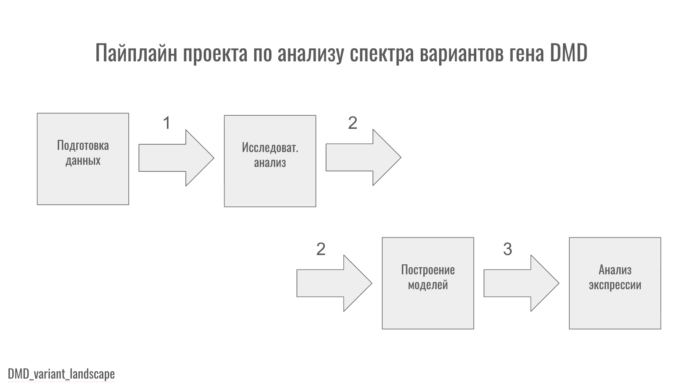
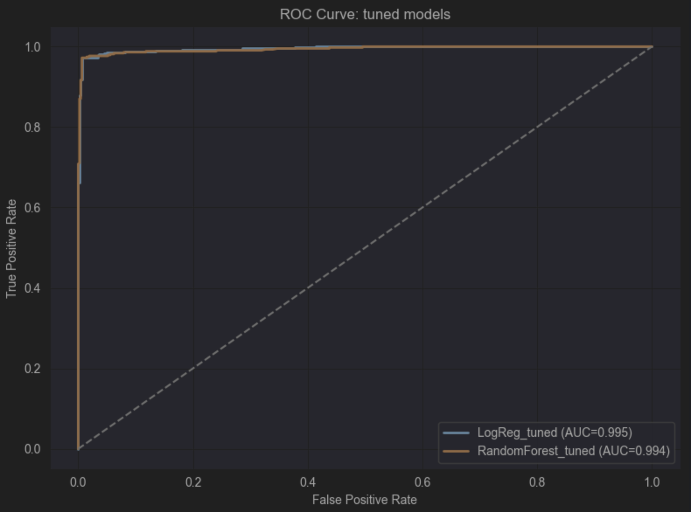
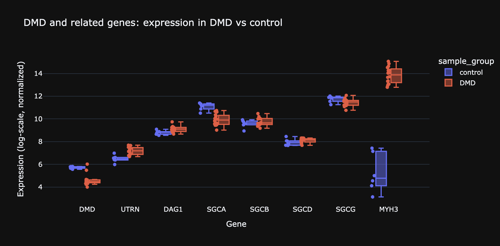
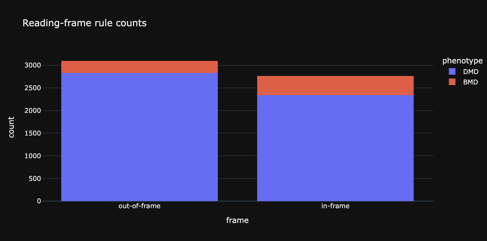
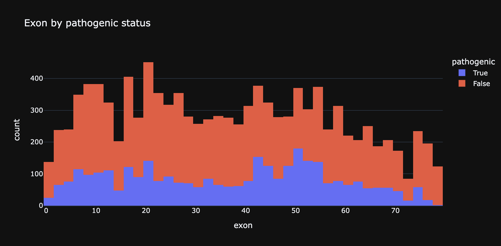
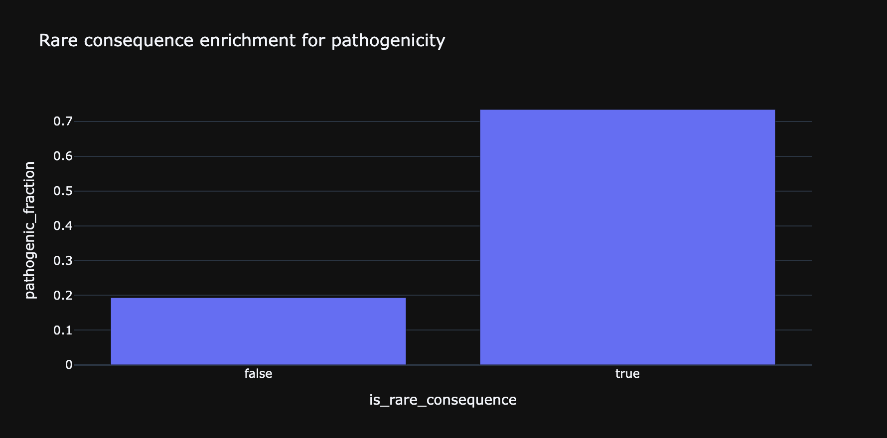
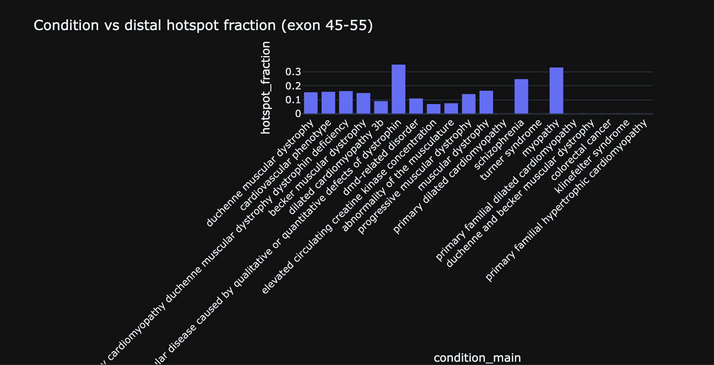
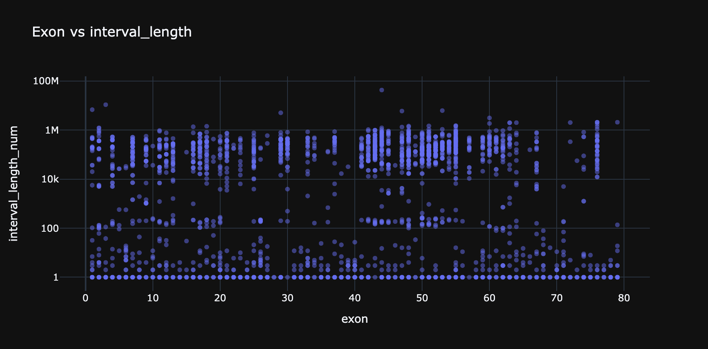
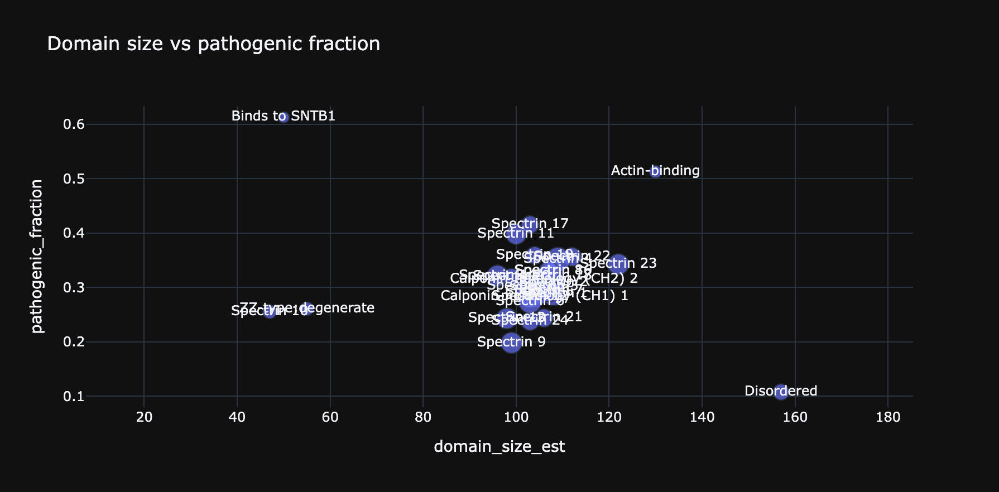
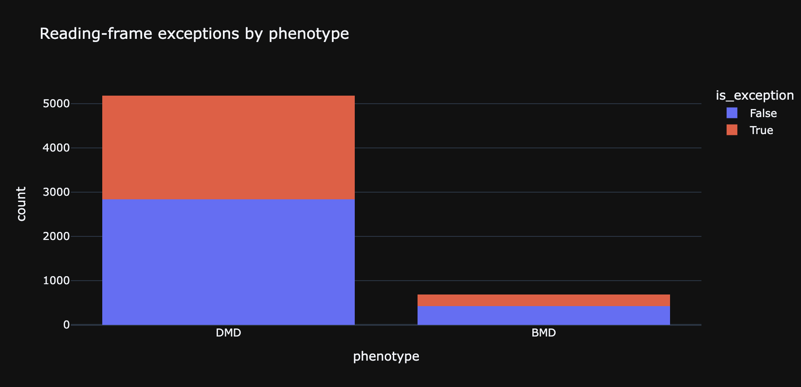

<p align="center">
  <a href="README_en.md">🇬🇧 English</a> |
  <a href="README_ja.md">🇯🇵 日本語</a> |
  <a href="README_fr.md">🇫🇷 Français</a> |
  <a href="README_ru.md">🇷🇺 Русский</a> 
</p>

# Анализ спектра вариантов гена DMD: эксплораторное исследование на основе объединённых данных из источников ClinVar, Ensembl и gnomAD


---
### Аннотация

Данный репозиторий содержит исследовательский анализ патогенных и непатогенных вариаций в **гене DMD** человека с использованием объединённых данных из биоинформатических источников. Цель исследования - изучить структурные и функциональные закономерности патогенности в рамках **экзонов**, **белковых доменов**, **статуса рамки считывания** и т.п.

Была проведена чистка и объединение изначальных наборов данных, на основе полученного датасета проведён **исследовательский анализ** вариантов, также были построены две **модели предсказывания** патогенности вариации в гене DMD на основе **логистической регрессии** (LogisticRegression) и **случайного леса** (RandomForest). Дополнительно, был также проведён **анализ экспрессии генов** у здоровых пациентов и пациентов, страдающих **мышечной дистрофией Дюшенна или Беккера**, с целью выявить влияние болезни на экспрессию **гена DMD** и **общую экспрессию генов** в организме.

---

### Содержание

- [Задача проекта](#задача-проекта)
- [Основные моменты и пайплайн проекта](#основные-моменты-и-пайплайн-проекта)
- [Наборы данных](#наборы-данных)
- [Методы](#методы)
- [Полученные метрики моделей](#полученные-метрики-моделей)
- [EDA: сопряжённость с литературой](#eda-сопряжённость-с-литературой)
- [Research-gap находки (??)](#research-gap-находки-)
- [Структура проекта](#структура-проекта)
- [Воспроизводимость](#воспроизводимость)
- [Следующие шаги](#следующие-шаги)
- [Лицензия](#лицензия)
- [Статус проекта](#статус-проекта----)

---

### Задача проекта

**Ген DMD** - крупнейший известный ген в геноме человека, расположенный на хромосоме X, кодирующий белок **дистрофин**. Данный белок связывает **структурный каркас** мышечных клеток с **окружающей матрицей**. Патогенные вариации в гене DMD приводят к **нарушению синтеза дистрофина**, в результате чего развивается группа **тяжёлых наследственных заболеваний**, среди них - **мышечная дистрофия Дюшенна** (Duchenne's muscular dystrophy, DMD), тяжёлая форма, приводящая к быстрому прогрессированию мышечной слабости, обездвиженности и кардиомиопатии, и **мышечная дистрофия Беккера** (Becker's muscular dystrophy, BMD), более лёгкая форма, которая характеризуется медленно прогрессирующей мышечной слабостью.

Задача проекта заключается в **изучении различных признаков** и паттернов вариаций в гене, которые определяют её **патогенность** и **непатогенность**, в том числе для последующей возможности **предсказывания** на их основе **патогенности последующих находимых вариаций**.

---

### Основные моменты и пайплайн проекта

Картинка, показывающая **пайплайн** данного проекта:



На этапе **подготовки данных** изначально были собраны **три таблицы** по вариантам гена DMD - из баз **ClinVar**, **Ensembl** и **gnomAD**. Далее, были **унифицированы ключи** (например, ``var_id``, ``rsid``), **приведены форматы** координат и категориальных полей к единому стандарту, были **удалены технические дубликаты** и пустые категории, а также были **нормализованы числовые признаки** с конкретной обработкой пропусков. После этого, было применено **поэтапное "склеивание"** (left-join от основной таблицы вариантов), на каждом шаге **контролируя** потери строк, рост пропусков и консистентность полей. Код всего вышеперечисленного находится в ``src/data_preparation.py``.

Далее, варианты **аннотируются**: в ``src/annotate_variants.py`` скрипт загружает **таблицу вариантов** и две **референсные таблицы** (границы доменов белка дистрофина и координаты экзонов DMD), затем для каждого варианта присваивает домен по **позиции аминокислоты** и экзон по **геномным координатам**. После этого формируются производные признаки, такие как **тип мутации** и **статус рамки считывания**: тип мутации агрегируется по колонкам consequence/variant-type с отдельным правилом для крупных событий, когда вариация происходит на уровне **нескольких нуклеотидов**, и её длина больше 50, а статус рамки счиитывания выводится из **класса мутации**. На выходе получается ``DMD_variants_annotated.csv``, датасет, с которым проводится **дальнейшая работа**.

Исследовательский анализ начинается с ``notebooks/00_data_preview.ipynb`` и ``notebooks/01_annotation_check.ipynb``, а затем **системно** проходятся блоки в ``notebooks/02_EDA``. На начальных этапах были проверены **уникальность** ``var_id`` и ``rsid``, дубликаты, доля пропусков, согласованность ``chr`` и ``pos``, покрытие по доменам, экзонам, и статусу рамки считывания. В результате стало понятно, что данные в целом пригодны для статистики, однако пропуски распределены неравномерно, так как они чаще концентрируются в более **сложных** вариантах и отдельных классах мутаций, поэтому нельзя было трактовать пропуск как случайный шум. 

Дальше, тесты дали **основную картину спектра** по фенотипу, типу мутации, статусу рамки считывания, домену, ``consequence``, длине интервала, метрикам ``REVEL/meta_lr``, частоте аллеля, а также по экзонам и аминокислотным позициям. В большинстве кросс-табличных и ранговых сравнений структура оказалась **неслучайной**: клинические группы действительно отличаются по типам мутаций и молекулярному контексту, патогенные варианты чаще связаны с более "радикальным" ``consequence``, а популяционные признаки ведут себя ожидаемо в сторону меньшей частоты у клиинически значимых вариантов.

Проверка ``⭐``-гипотез (результаты из научной литературы) в целом **подтвердила известные литературные опоры**: reading-frame rule (связь статуса рамки считывания и фенотипа DMD/BMD), hotspot-архитектуру экзонов (включая дистальную зону 45-55), **клиническую релевантность** изоформных и дистальных регионов (dp140, dp71), а также **терапевтический фокус** skip-регионов (в том числе skip51). Сходным образом согласуются и доменно-структурные наблюдения и функциональные ``score``-метрики REVEL и MetaLR как маркеры патогенности. 

``📖``-блоки показали редкие обогащения ``consequence``, энтропийные профили, **анализ исключений** из правила статуса рамки считывания и доменно-позиционные аномалии. Главный результат заключается в **выделении конкретных зон**, где разметка расходится или остаётся **недоописанной**. Данные "места" требуют **внешней валидации** на независимом наборе и углубленной ревизии, которые могут быть либо реальным новым сигналом, либо артефактом данного источника.

В построении моделей предсказывания решалась задача **бинарной классификации** вариантов гена DMD на ``pathogenic`` и ``benign`` на основе аннотированных признаков из общего пайплайна (``exon/domain/mutation/frame`` и прочие поля). Подготовка данных была сделана с акцентом на фильтрацию шумовых категорий, контроль дубликатов, фичеинжиниринг, а также проверку устойчивости на кросс-валидации. Были обучены две интерпретируемые базовые модели - **LogisticRegression** и **RandomForest**, сохранены в ``.pkl``. Оценка была построена по набору метрик, таких как ``accuracy``, ``AUROC``, ``confusion matrix``.

Итог по качеству получился **сильный**: достигнут высокий уровень точности (у LogisticRegression: accuracy ``~0.982``, AUROC ``~0.995``). Высокая AUROC рассматривалась вместе с порогозависимыми метриками и рисками утечки, что делает выводы вопроизводимыми. Тем не менее, **требуется внешняя валидация** на независимом датасете.



В **блоке экспрессии**, мы использовали набор **Gene Expression Omnibus** ``GSE38417`` где были извлечены **матрица экспрессии** и **фенотипы**, сформированы группы **DMD** и **контрольная**. После этого был проведён **дифференциальный анализ**, чтобы посмотреть, как ведут себя ``DMD`` и связанные маркеры в больных относительно контроля.

По результатам получились следующие результаты: в дифференциальных сигналах выделяются **гены регенерации мышцы** (в том числе ``MYH3/MYH8``), что согласуется с хроническим повреждением и **регенераторным ответом** при мышечной дистрофии Дюшенна. 



---

### Наборы данных

В проекте используется интегрированный датасет вариантов **гена DMD**, собранный из открытых источников **ClinVar** (клиническая интерпретация), **Ensembl** (геномно-транскриптная аннотация) и **gnomAD** (популяционные частоты). Финальная рабочая таблица хранится в:
```commandline
data/processed/DMD_variants_annotated.csv
```

Таблица содержит ключевые поля для **клинико-генетического** анализа: координаты вариации, **тип** события, consequence, экзон, домен, **статус** рамки считывания, функциональные **скоры** REVEL, MetaLR, и клинические метки патогенности/фенотипа.

Размер итогового набора: **11308 вариантов на 29 признаков**. По клиническим классам `clinvar_class_simple` представлены патогенные варианты (`pathogenic`, 2858), вероятно патогенные варианты (`likely_pathogenic`, 560), здоровые (`benign`, 640), вероятно здоровые (`likely_benign`, 3062), с неизвестными последствиями (`vus`, 3251), и другие (`other`, 937); по фенотипу `phenotype_group`: мышечная дистрофия Дюшенна (`DMD`, 7807), мышечная дистрофия Беккера (`BMD`, 1023), и прочие (`other`, 2478). Для экспрессий отдельно используется набор данных от **Gene Expression Omnibus** - набор **GSE38417**.

Ограничения набора связаны с природой исходных баз, так как они являются агрегированными наблюдениями с неоднородной глубиной клинической аннотации, часть полей может быть неполной или неоднозначной (например, `vus`, смешанные формулировки фенотипа и состояния пациента).

Ключевые источники bias: в **ClinVar** публикуются преимущественно клинически интересные варианты, **label-noise** в likely/vus-категориях, популяционная неоднородность частот **gnomAD** и зависимость ряда признаков от качества первичной аннотации.

### Я благодарю администраторов вышеупомянутых баз данных за предоставление открытого доступа к геномным и клиническим данным.

**Обратите внимание**, что в данный репозиторий включены только обработанные данные. На исходные данные по-прежнему распространяются условия лицензий исходных баз данных (см. `data/raw/raw_info.md`).

---
### Методы

Для ``02_EDA`` мы используем единый воспроизводимый статистический стек: предварительная нормализация и чистка категориальных и числовых полей (включая удаление placeholder-категорий), затем комбинация описательной аналитики (частоты, доли, кросс-таблицы, CI, энтропия) и проверок гипотез, подобранных под тип данных - Fisher Exact для 2 на 2 и редких событий, хи-квадрат для категориальный ассоциаций, критерии Манна-Уитни и Краскалл-Уоллиса для непараметрических сравнений распределений, критерий Спирмена для монотонных связей и KS для сравнения форм распределений; результаты визуализируются в Plotly (bar, heatmap, box, scatter, density, lollipop).

В ML-части проекта решается задача бинарной классификации вариантов DMD: ``pathogenic`` против ``benign``. Целевая метка формируется из ``clinvar_class_simple`` по схеме ``likely-inclusive``: ``pathogenic + likely_pathogenic`` это ``1``, ``benign + likely_benign`` это ``0``, варианты других классов в обучение не включаются. Это позволяет использовать больше размеченных примеров, сохраняя клинический смысл таргета. Перед обучением выполняется дедупликация и удаление конфликтных дублей (когда один и тот же вариант встречается с разными метками).

В качестве признаков используются структурные и функциональные характеристики варианта: номер экзона, домен белка, агрегированный тип мутации, статус рамки считывания, consequence/variant-type, а также числовые признаки (``interval_length``, ``aa_pos``, ``revel``, ``meta_lr``, ``allele_freq`` и др). Категориальные признаки кодируются через `OneHotEncoder`, числовые масштабируются и при необходимости импутируются внутри пайплайна. Важно заметить, что поля, напрямую участвующие в формировании таргета не используются как входные признаки.

Обучаются две модели: ``LogisticRegression`` (как интерпретируемый линейный базис) и ``RandomForestClassifier`` (как нелинейный ансамбль). Логистическая регрессия даёт стабильную интерпретацию вклада признаков через коэффициенты, а RandomForest лучше улавливает нелинейные взаимодействия между молекулярными характеристиками. Обе модели обучаются в едином препроцессинговом пайплайне, что делает сравнение корректным и воспроизводимым.

Для валидации используется схема с учётом групп, чтобы близкие варианты не протекали между train и test. На этапе кросс-валидации применяется ``StratifiedGroupKFold``, а в финальной оценке дополнитлеьно фиксируются holdout-метрики. Качество оценивается по набору показателей (``ROC-AUC``, ``accuracy``, ``balanced accuracy``, ``F1``, ``confusion matrix``), а также через sanity-check (включая перестановочные проверки) на предмет утечки и переобучения. Обе обученные модели сохраняются в ``models/`` как отдельные ``.pkl``-артефакты.

---
### Полученные метрики моделей

В проекте разделяется оценка качества на два уровня: **holdout** (отложенная выборка) и **group-aware кросс-валидация**. Для холдаута считаем четыре ключевые метрики: ``accuracy``, ``AUROC``, ``F1``, ``balanced accuracy``, чтобы не опираться на одну цифру. Лучшей оказалась логистическая регрессия.

Для **CV** (5-fold StratifiedGroupKFold) мы считаем те же четыре метрики и смотрим среднее и разброс по фолдам.

Ключевой вывод по разделу метрик: холдаут и кросс-валидация дают согласованную картину без резкого провала вне обучения, а разброс по фолдам небольшой, что говорит о стабильности пайплайна. При этом остаётся главное ограничение: **отсутствие внешней валидации**.


| Model | Holdout Accuracy | Holdout ROC-AUC | Holdout F1 | Holdout Balanced Acc | CV Accuracy (mean ± std) | CV ROC-AUC (mean ± std) | CV F1 (mean ± std) | CV Balanced Acc (mean ± std) |
|---|---:|---:|---:|---:|---:|---:|---:|---:|
| LogReg_tuned | 0.9833 | 0.9950 | 0.9825 | 0.9829 | 0.9815 ± 0.0041 | 0.9965 ± 0.0009 | 0.9813 ± 0.0043 | 0.9815 ± 0.0041 |
| RandomForest_tuned | 0.9822 | 0.9936 | 0.9813 | 0.9817 | 0.9806 ± 0.0030 | 0.9948 ± 0.0008 | 0.9804 ± 0.0031 | 0.9806 ± 0.0029 |

---
### EDA: сопряжённость с литературой

#### 1. Reading-frame rule: подтверждается на уровне когорты

В анализе связь `frame_status` с фенотипом (`DMD/BMD`) воспроизводит классическое наблюдение: варианты `out-of-frame` значительно чаще ассоциированы с более тяжелым клиническим профилем, тогда как `in-frame` — с более мягким. Это согласуется с базовой моделью dystrophinopathies, но мы не делаем overclaim на уровне индивидуального прогноза для каждого варианта.

**Статья:**  
Koenig et al., 1989 — [PubMed](https://pubmed.ncbi.nlm.nih.gov/2491009/)  
Aartsma-Rus et al., 2006 — [PubMed](https://pubmed.ncbi.nlm.nih.gov/16770791/)


#### 2. Hotspot-архитектура экзонов в целом консистентна с реестрами

Распределение событий по экзонам в нашем наборе демонстрирует кластеризацию в горячих участках, что согласуется с крупными базами по DMD. Это подтверждает, что структура вариаций в проекте биологически правдоподобна и не выглядит как случайный артефакт сэмплирования.

**Статья:**  
Bladen et al., 2015 (TREAT-NMD, >7000 мутаций) — [PubMed](https://pubmed.ncbi.nlm.nih.gov/25604253/)  
Tuffery-Giraud et al., 2009 — [PubMed](https://pubmed.ncbi.nlm.nih.gov/19367636/)


#### 3. Терапевтические skip-регионы: направление эффекта совпадает с литературой
В блоке `02N` (skip45/51/53) мы видим ожидаемую клиническую неоднородность по терапевтически релевантным регионам, что соответствует логике литературы по exon-skipping applicability (включая приоритетность exon 51 для значимой доли пациентов). Интерпретация аккуратная: это популяционный сигнал, а не оценка эффективности конкретной терапии.

**Статья:**  
Aartsma-Rus et al., 2009 — [PubMed](https://pubmed.ncbi.nlm.nih.gov/19156838/)

#### 4. Дистальные изоформы (Dp140/Dp71): тренд согласуется с клиническими работами
В `02M` наблюдения по `dp140/dp71` и phenotype согласуются по направлению с исследованиями, где дистальные участки и мозговые изоформы связывают с более тяжелым/осложненным клиническим профилем. При этом мы не переносим выводы на нейрокогнитивные исходы напрямую, потому что наш датасет не специализирован под глубинную когнитивную фенотипизацию.

**Статья:**  
Moizard et al., 1998 — [PubMed](https://pubmed.ncbi.nlm.nih.gov/9800909/)  
Bardoni et al., 2000 — [PubMed](https://pubmed.ncbi.nlm.nih.gov/10734267/)  
Milic Rasic et al., 2015 — [PubMed](https://pubmed.ncbi.nlm.nih.gov/25937795/)

#### 5. Functional/population признаки: согласуются как supporting evidence, но не как standalone
В `02J/02K` сигналы `REVEL/meta_lr` и популяционных частот (`in_gnomad`, `allele_freq`) ведут себя в ожидаемом направлении для benign vs pathogenic разделения. Это хорошо ложится на практику клинической интерпретации: in-silico и population критерии повышают уверенность, но сами по себе не заменяют совокупную экспертную классификацию.

**Статья:**  
REVEL (Ioannidis et al., 2016) — [DOI](https://doi.org/10.1016/j.ajhg.2016.08.016)  
dbNSFP v3.0 (MetaLR) — [PubMed](https://pubmed.ncbi.nlm.nih.gov/26555599/)  
ACMG/AMP guideline — [PubMed](https://pubmed.ncbi.nlm.nih.gov/25741868/)

---

### Research-gap находки (??)

⚠️ **Важно! Все гипотезы применяются исключительно к данному датасету, и их следствия не имплицируются в реальность (другими словами, никаких серьёзных заявлений данный проект не делает 😊): требуется проверка на других наборах данных.**

#### 1. Редкие consequence-классы показывают сильное обогащение по патогенности


В блоке consequence видно, что редкие consequence-категории связаны с гораздо более высокой долей патогенных вариантов: `pathogenic_fraction = 0.734` против `0.193` у не-редких, `OR = 11.54` (95% CI `10.37-12.84`, `p < 1e-6`). Это сильный статистический сигнал, но его корректно трактовать как гипотезу о редких высокорисковых классах, потому что в ClinVar возможен sampling bias по клинически заметным вариантам.

#### 2. Семантика condition_raw может скрывать биологически разные подгруппы



В condition-блоке обнаружено, что не все клинические формулировки ведут себя одинаково относительно hotspot-областей: например, для одной агрегированной “neuromuscular disease …” категории `OR ≈ 3.00`, `p ≈ 1.0e-9`, тогда как для “duchenne muscular dystrophy” эффект незначим (`OR ≈ 0.92`, `p ≈ 0.26`). Это указывает на потенциальный research-gap в клинической онтологии: coarse-grained текстовые condition-метки могут смешивать подтипы с разной генетической архитектурой.  

#### 3. Связь позиции по экзону с длиной события есть, но эффект очень мал



Для `exon_num` vs `interval_length` получена статистически значимая, но слабая монотонная связь: `Spearman rho = 0.072`, `p = 0.000484`, `n = 2328`. Это означает, что позиционный градиент существует, но сам по себе объясняет небольшую долю различности длины событий; нужны регион-специфичные модели и стратификация по классам мутаций.  

#### 4. Доменный масштаб и патогенность: есть тренд, но пока недостаточно мощности



На уровне доменов наблюдается положительный тренд между размером домена и долей патогенных вариантов (`rho = 0.276`), но статистической значимости нет (`p = 0.133`, `n_domains = 31`). Одновременно энтропия доменного распределения высокая (`4.85 bits`), что подтверждает структурную неоднородность. Сигнал может быть реальным, но текущая мощность недостаточна для уверенного вывода.  

#### 5. Исключения из reading-frame rule и мета-неконсистентность требуют отдельного QC-слоя



В exception-анализе обнаружено обогащение исключений в rod-домене (`OR = 1.25`, 95% CI `1.03–1.51`, `p = 0.0259`), а в meta-consistency блоке отмечено `1304` потенциально неконсистентных варианта (`mismatch_any`). Часть биологии действительно выходит за простую рамку правил, а часть может быть следствием шума в аннотациях. Нужна внешняя валидация.

---
### Структура проекта

```commandline
DMD_variant_landscape/
├── data/                          # Данные проекта (raw + processed)
│   ├── raw/                       # Исходные выгрузки (ClinVar/Ensembl/gnomAD/GEO и др.)
│   │   ├── annotation/            # Сырые таблицы для экзонов/доменов
│   │   └── expression/            # Файлы экспрессии (напр. GSE38417 series matrix)
│   └── processed/                 # Подготовленные таблицы для анализа/моделирования
│       ├── annotation/            # Нормализованные аннотации (экзоны/домены)
│       ├── DMD_variants_master.csv
│       └── DMD_variants_annotated.csv
│
├── notebooks/                     # Jupyter-ноутбуки по этапам проекта
│   ├── 00_data_preview.ipynb      # Первичный QC и обзор структуры данных
│   ├── 01_annotation_check.ipynb  # Проверка корректности аннотаций
│   ├── 02_EDA/                    # Основной EDA-блок (02A–02O)
│   │   ├── 02A_dataset_integrity.ipynb
│   │   ├── 02B_clinical_structure.ipynb
│   │   ├── ...
│   │   └── 02O_meta_consistency.ipynb
│   ├── 03_model_training.ipynb    # Обучение/оценка ML-моделей
│   └── 04_expression_analysis.ipynb # Анализ экспрессии (GEO GSE38417)
│
├── src/                           # Скриптовый пайплайн проекта
│   ├── data_preparation.py        # Очистка/merge исходных источников
│   ├── annotate_variants.py       # Аннотация exon/domain/mutation/frame
│   ├── exploratory.py             # Скриптовые EDA-графики/таблицы
│   ├── modeling.py                # ML-пайплайн (LogReg + RandomForest, валидация)
│   └── utils.py                   # Общие функции (очистка, тесты, QC, helper-метрики)
│
├── models/                        # Сохранённые модели
│   ├── model_logreg.pkl           # Логистическая регрессия
│   ├── model_random_forest.pkl    # RandomForest
│   └── model.pkl                  # Лучший/актуальный алиас модели
│
├── figures/                       # Графики и визуализации, создающиеся скриптами
│   └── ...
│ 
├── assets/                        # Красивые штучки для README.md
│   └── ...
│ 
├── requirements.txt               # Python-зависимости
├── README.md                      # Описание проекта и результаты
└── LICENSE                        # Лицензия репозитория
```
---

### Воспроизводимость

Установите Python `3.11+` (рекомендуется `3.12`), создайте виртуальное окружение и установите зависимости: 

```commandline
python -m venv .venv && source .venv/bin/activate && pip install -r requirements.txt
```

Далее проверьте, что в `data/raw/` лежат исходные выгрузки (ClinVar/gnomAD/Ensembl; для expression-модуля — GEO `GSE38417`). После этого запустите скриптовый пайплайн по шагам из корня репозитория: 
```commandline
python src/data_preparation.py
python src/annotate_variants.py
python src/exploratory.py
python src/modeling.py
```
Если вы скачали в уже подготовленный набор данных (annotated), то достаточно просто:

```commandline
python src/exploratory.py
python src/modeling.py
```

Для интерактивного анализа откройте Jupyter: `jupyter lab`, затем последовательно выполните `notebooks/00_data_preview.ipynb`, `01_annotation_check.ipynb`, блок `02_EDA/`, `03_model_training.ipynb` и `04_expression_analysis.ipynb`.

Проект фиксирует ключевые источники воспроизводимости: единый `RANDOM_STATE=42` в ML-пайплайне, group-aware валидацию (`StratifiedGroupKFold`) и детерминированный баланс классов с фиксированным seed. Все зависимости перечислены в [requirements.txt](/Users/franceballin/PycharmProjects/DMD_variant_landscape/requirements.txt), основные артефакты сохраняются в `models/` (`model_logreg.pkl`, `model_random_forest.pkl`, `model.pkl`) и `figures/` (ROC/feature importance/confusion matrix и EDA/expression графики).

---

### Следующие шаги

Следующий приоритетный шаг — **внешняя валидация** на независимом наборе (не ClinVar-centric), чтобы проверить переносимость модели за пределы текущего источника и оценить, как меняются метрики при другом распределении классов и аннотаций. Практически это означает повтор полного infer-пайплайна на внешнем датасете с тем же feature engineering, фиксированными `.pkl`-моделями и отдельным отчётом по `accuracy / balanced accuracy / F1 / ROC-AUC`, включая разбор ошибок по мутационным классам и экзонным регионам. Такой шаг закроет главный риск dataset-specific performance и даст более честную оценку клинической обобщаемости.

Параллельно стоит добавить **prospective validation** и **калибровку вероятностей**. Prospective-сценарий: модель тестируется на “новых во времени” вариантах (temporal split), а не только на случайном holdout; это ближе к реальному применению в потоке новых интерпретаций. 

---
### Список литературы

#### DMD genotype-phenotype, hotspots, domains, isoforms

1. Koenig M, Beggs AH, Moyer M, et al. **The molecular basis for Duchenne versus Becker muscular dystrophy: correlation of severity with type of deletion**. *Am J Hum Genet*. 1989;45(4):498-506. PMID: 2491009.  
   https://pubmed.ncbi.nlm.nih.gov/2491009/

2. Aartsma-Rus A, van Deutekom JCT, Fokkema IFJ, van Ommen GJB, den Dunnen JT. **Entries in the Leiden Duchenne muscular dystrophy mutation database: an overview of mutation types and paradoxical cases that confirm the reading-frame rule**. *Muscle Nerve*. 2006;34(2):135-144. PMID: 16770791.  
   https://pubmed.ncbi.nlm.nih.gov/16770791/

3. Tuffery-Giraud S, Béroud C, Leturcq F, et al. **Genotype-phenotype analysis in 2,405 patients with a dystrophinopathy using the UMD-DMD database**. *Hum Mutat*. 2009;30(6):934-945. doi:10.1002/humu.20976. PMID: 19367636.  
   https://pubmed.ncbi.nlm.nih.gov/19367636/

4. Bladen CL, Salgado D, Monges S, et al. **The TREAT-NMD DMD Global Database: analysis of more than 7,000 Duchenne muscular dystrophy mutations**. *Hum Mutat*. 2015;36(4):395-402. doi:10.1002/humu.22758. PMID: 25604253.  
   https://pubmed.ncbi.nlm.nih.gov/25604253/

5. Matsumura K, Nonaka I, Tomé FMS, et al. **Mild deficiency of dystrophin-associated proteins in Becker muscular dystrophy patients having in-frame deletions in the rod domain of dystrophin**. *Am J Hum Genet*. 1993;53(2):409-416. PMID: 8328458.  
   https://pubmed.ncbi.nlm.nih.gov/8328458/

6. Moizard MP, Billard C, Toutain A, et al. **Are Dp71 and Dp140 brain dystrophin isoforms related to cognitive impairment in Duchenne muscular dystrophy?** *Am J Med Genet*. 1998;80(1):32-41. PMID: 9800909.  
   https://pubmed.ncbi.nlm.nih.gov/9800909/

7. Bardoni A, Felisari G, Sironi M, et al. **Loss of Dp140 regulatory sequences is associated with cognitive impairment in dystrophinopathies**. *Neuromuscul Disord*. 2000;10(3):194-199. doi:10.1016/S0960-8966(99)00108-X. PMID: 10734267.  
   https://pubmed.ncbi.nlm.nih.gov/10734267/

8. Milic Rasic V, Vojinovic D, Pesovic J, et al. **Intellectual ability in the Duchenne muscular dystrophy and dystrophin gene mutation location**. *Balkan J Med Genet*. 2015;17(2):25-35. doi:10.2478/bjmg-2014-0071. PMID: 25937795.  
   https://pubmed.ncbi.nlm.nih.gov/25937795/

#### Exon-skipping and therapy-relevant regions

9. Aartsma-Rus A, Fokkema I, Verschuuren J, et al. **Theoretic applicability of antisense-mediated exon skipping for Duchenne muscular dystrophy mutations**. *Hum Mutat*. 2009;30(3):293-299. doi:10.1002/humu.20918. PMID: 19156838.  
   https://pubmed.ncbi.nlm.nih.gov/19156838/

10. Waldrop MA, Ben Yaou R, Lucas KK, et al. **Clinical Phenotypes of DMD Exon 51 Skip Equivalent Deletions: A Systematic Review**. *J Neuromuscul Dis*. 2020;7(3):217-229. doi:10.3233/JND-200483. PMID: 32417793.  
   https://pubmed.ncbi.nlm.nih.gov/32417793/

#### Variant interpretation, functional predictors, population criteria

11. Richards S, Aziz N, Bale S, et al. **Standards and guidelines for the interpretation of sequence variants (ACMG/AMP)**. *Genet Med*. 2015;17(5):405-424. doi:10.1038/gim.2015.30. PMID: 25741868.  
   https://pubmed.ncbi.nlm.nih.gov/25741868/

12. Ghosh R, Harrison SM, Rehm HL, Plon SE, Biesecker LG. **Updated Recommendation for the Benign Stand Alone ACMG/AMP Criterion (BA1)**. *Hum Mutat*. 2018;39(11):1525-1530. doi:10.1002/humu.23642. PMID: 30311383.  
   https://pubmed.ncbi.nlm.nih.gov/30311383/

13. Ioannidis NM, Rothstein JH, Pejaver V, et al. **REVEL: An Ensemble Method for Predicting the Pathogenicity of Rare Missense Variants**. *Am J Hum Genet*. 2016;99(4):877-885. doi:10.1016/j.ajhg.2016.08.016. PMID: 27666373.  
   https://pubmed.ncbi.nlm.nih.gov/27666373/

14. Liu X, Wu C, Li C, Boerwinkle E. **dbNSFP v3.0: A One-Stop Database of Functional Predictions and Annotations for Human Nonsynonymous and Splice-Site SNVs**. *Hum Mutat*. 2016;37(3):235-241. doi:10.1002/humu.22932. PMID: 26555599.  
   https://pubmed.ncbi.nlm.nih.gov/26555599/

#### Data resources used in the project

15. Landrum MJ, Lee JM, Benson M, et al. **ClinVar: improving access to variant interpretations and supporting evidence**. *Nucleic Acids Res*. 2018;46(D1):D1062-D1067. doi:10.1093/nar/gkx1153.  
   https://academic.oup.com/nar/article/46/D1/D1062/4641904

16. Karczewski KJ, Francioli LC, Tiao G, et al. **The mutational constraint spectrum quantified from variation in 141,456 humans (gnomAD)**. *Nature*. 2020;581:434-443. doi:10.1038/s41586-020-2308-7. PMID: 32461654.  
   https://pubmed.ncbi.nlm.nih.gov/32461654/

17. Harrison PW, Amode MR, Austine-Orimoloye O, et al. **Ensembl 2024**. *Nucleic Acids Res*. 2024;52(D1):D891-D899. doi:10.1093/nar/gkad1049. PMID: 37953337.  
   https://pubmed.ncbi.nlm.nih.gov/37953337/

18. NCBI GEO. **GSE38417: Gene expression data from Duchenne muscular dystrophy patients versus controls**.  
   https://www.ncbi.nlm.nih.gov/geo/query/acc.cgi?acc=GSE38417

19. Darras BT, Urion DK, Ghosh PS. **Dystrophinopathies (GeneReviews®)**. Last revision: 2022.  
   https://www.ncbi.nlm.nih.gov/books/NBK1119/

---

### Лицензия

Этот проект распространяется по лицензии **MIT**.

Подробности см. в файле LICENSE.

---

### Статус проекта: 🟩 🟨 🟨 

Техническая часть проекта завершена! 🎉 

**Проект в настоящее время находится на стадии валидации результатов.** 

---

© 2026, Mikhail Kolesnikov (Михаил Колесников) \
Moscow, Higher School of Economics, Faculty of Computer Science, BSc 

MIT License\
GitHub: https://github.com/curryy77