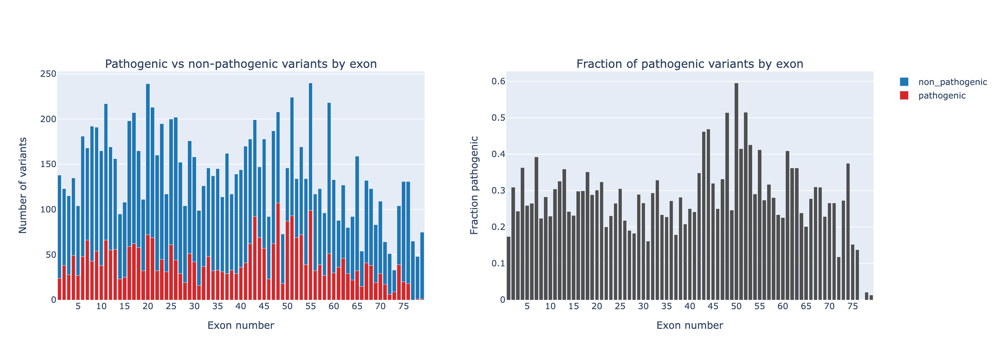
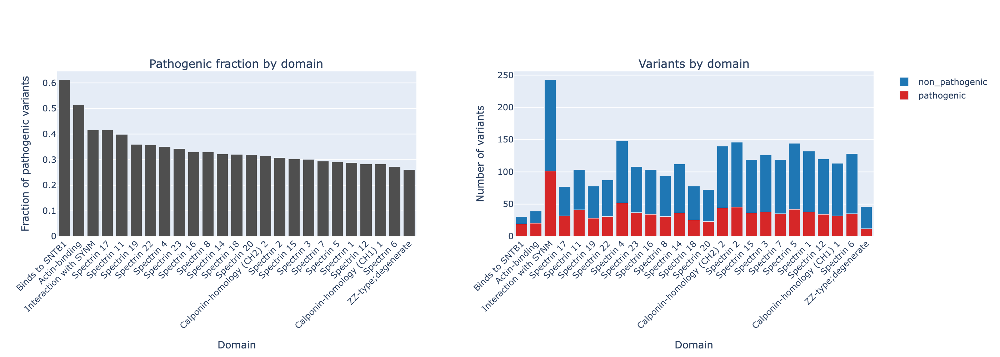
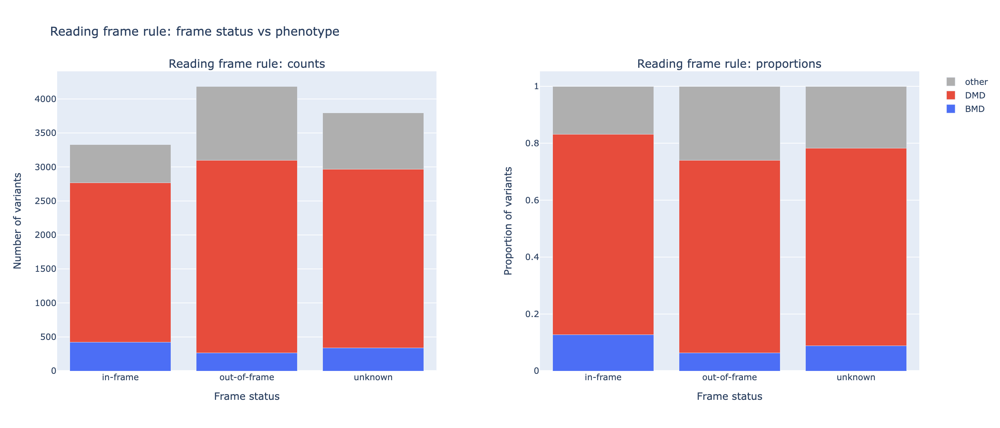

<p align="center">
  <a href="README_en.md">🇬🇧 English</a> |
  <a href="README_ja.md">🇯🇵 日本語</a> |
  <a href="README_fr.md">🇫🇷 Français</a> |
  <a href="README_ru.md">🇷🇺 Русский</a> 
</p>

# Анализ спектра вариантов DMD


---
### О проекте

Исследовательский анализ патогенных и непатогенных вариантов в **гене DMD** с использованием аннотированных наборов данных о вариантах. Цель исследования — изучить структурные и функциональные закономерности патогенности в рамках **экзонов**, **белковых доменов** и **статуса рамки считывания**.

---

### Наборы данных
В анализе используется аннотированный набор данных **вариантов гена DMD** (объединенный из баз данных **ClinVar**, **Ensembl** и **gnomAD**), содержащий геномную позицию, номер экзона, белковый домен, классификацию патогенности, класс фенотипа (DMD или BMD) и статус рамки считывания (в рамках или вне рамок). Варианты были предварительно обработаны и хранятся в:
```commandline
data/processed/DMD_variants_annotated.csv
```

---
### Проведенные (на данный момент) анализы

#### 1. Распределение вариантов на уровне экзонов
Прежде всего, мы проанализировали распределение патогенных и непатогенных вариантов по всем **79 экзонам гена DMD**.



Созданы две взаимодополняющие визуализации: **количество вариантов на экзон** и **доля патогенных вариантов на экзон**.

Мы наблюдаем значительную концентрацию вариантов в экзонах 42–56, что соответствует области частых делеций в гене DMD, описанной в ряде исследований (Monaco et al., 1988; Aartsma-Rus et al., 2006; Bladen et al., 2015).

Этот участок перекрывается с центральным стержневым доменом дистрофина, который содержит множество спектрин-подобных повторов.

#### 2. Патогенность на уровне домена
Варианты были сопоставлены (сопоставление предоставлено UniProt) с функциональными **белковыми доменами** дистрофина. Для каждого домена мы рассчитали общее количество вариантов и долю патогенных вариантов.



К доменам с наибольшей долей патогенности относятся **домен связывания с актином**, **область связывания с SNTB1** и **область взаимодействия с синтрофином**. Эти домены соответствуют **критическим интерфейсам взаимодействия**, необходимым для выполнения дистрофином своей структурной роли в дистрофин-гликопротеиновом комплексе. Предполагается, что мутации в таких областях чаще нарушают функцию белка и демонстрируют более высокую патогенность (Ervasti & Campbell, 1993; Koenig et al., 1988; Blake et al., 2002).

#### 3. Анализ правила рамки считывания
Было проверено классическое правило  рамки считывания, описанное в работе (Monaco et al., 1988) в контексте дистрофинопатий. Согласно этому правилу, мутации со сдвигом рамки считывания, как правило, приводят к тяжелой форме DMD (мышечная дисторфия Дюшенна), тогда как мутации без сдвига рамки считывания приводят к более легкой форме — мышечной дистрофии Беккера.



Были сгенерированы данные о количестве вариантов по фенотипу и статусу рамки, а также график, отражающий доли фенотипов. 

Результаты соответствуют ожидаемой тенденции: мутации вне рамки считывания преобладают при DMD, тогда как мутации в рамках считывания чаще встречаются при BMD. Однако наблюдаются и исключения. Такие исключения могут возникать вследствие нарушения критически важных функциональных доменов, эффектов альтернативного сплайсинга и структурной нестабильности укороченного дистрофина.

---
### Биологическая интерпретация

Анализ выявляет ряд важных свойств ландшафта мутаций DMD: **горячие точки мутаций соответствуют структурно повторяющимся участкам** гена, **функциональные домены связывания** демонстрируют **повышенную частоту патогенности**, **правило рамки считывания Монако** **в целом подтверждается**, но не является абсолютным.

---
### TODO

В планах по расширению анализа предусмотрены: **статистические тесты обогащения**, **анализ отношения шансов** для определения патогенности доменов, **моделирование** плотности мутаций на уровне экзонов, **интеграция со структурными данными** доменов дистрофина, а также сравнение с **частотами популяционных вариантов**.

---
### Data Sources

В рамках анализа объединены данные о вариантах из нескольких общедоступных баз данных:

- **ClinVar** — клинические аннотации вариантов
- **gnomAD** — частоты аллелей в популяции
- **Ensembl** — геномные аннотации и структура транскриптов
- **GEO (GSE38417)** — набор данных по экспрессии генов

Мы благодарим администраторов вышеупомянутых баз данных за предоставление открытого доступа к геномным и клиническим данным.

---
### Лицензия

Этот проект распространяется по лицензии MIT.

Подробности см. в файле LICENSE.

---

### Статус проекта: 🟨 🟨 🟨 
Этот репозиторий содержит конвейер для предварительного анализа спектра вариантов DMD. 

**Проект в настоящее время находится в стадии активной разработки!** Этот файл README.md является временным и будет изменен после завершения проекта.

---

© 2026, Mikhail Kolesnikov (Михаил Колесников) \
Moscow, Higher School of Economics, Faculty of Computer Science, BSc 

MIT License\
GitHub: https://github.com/curryy77